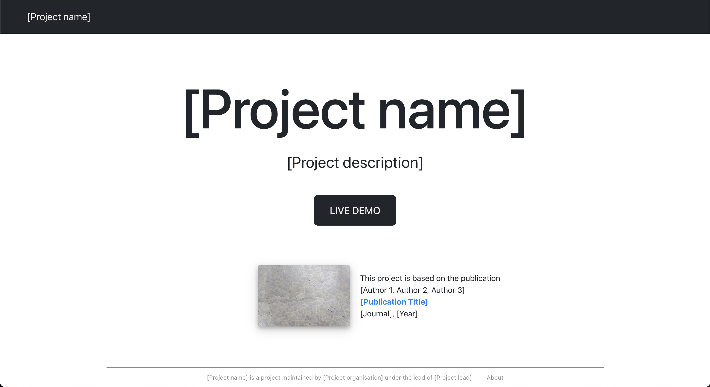

# Demo Template

This project provides a starting point for demos or lightweight focus projects like the
[PAVED demo](https://paved.iva.igd.fraunhofer.de/).
It is a template that aims at facilitating and accelerating the setup of lightweight demos or student projects.



## Usage

### Installation

The setup requires [Node.js v16 or higher](https://nodejs.org/en/download/).

Open the command-line interface in a folder of your choice on your machine and clone this repository.
Then navigate to the project directory, which now contains the local copy of the repository. You are in the correct folder if it contains, among others, the _public_ and _src_ folders.

```bash
git clone https://github.com/fraunhofer-igd-iva/demo-template.git
cd demo-template
```

In the project directory, run `npm install` to install or update the package dependencies.

### Run the app

In the project directory, run `npm start` to run the web app in the development mode.\
Open [http://localhost:3000](http://localhost:3000) to view the running app in the browser.\
The page will automatically reload if you make changes to the code.
The app can be stopped via `STRG+C` (`CTRL+C` under Mac) in the command-line interface.

## Demo Application

A demo application, which builds upon this template, is deployed at https://paved.iva.igd.fraunhofer.de/.

## Dependencies

This project depends on
- [React](https://react.dev/) together with [React DOM](https://react.dev/reference/react#react-dom) as a React renderer for the web and [React Router DOM](https://create-react-app.dev/docs/adding-a-router/) for using the React Router
- [Reactstrap](https://reactstrap.github.io/) and [Bootstrap](https://getbootstrap.com/) for tooltip and menubar
- [FortAwesome](https://github.com/FortAwesome) for Font Awesome icons
- [React Layout Components](https://github.com/fraunhofer-igd-iva/react-layout-components) for sidebar layout

## License

This project is released under the Apache-2.0 license. See the [LICENSE](LICENSE) file for detailed information.

## Contributions

We welcome and appreciate all contributions to this project.
Before getting started, try searching the issue tracker for known issues or fixes. For significant changes, in particular those that are based on your personal opinion, please open an issue first describing the changes you would like to make.

## Authors

[Lena Cibulski](https://www.igd.fraunhofer.de/en/institute/employees/lena-cibulski.html), Fraunhofer IGD

## Further References

This project is based on Create React App. You can learn more in the [Create React App documentation](https://facebook.github.io/create-react-app/docs/getting-started).

To get started with React, check out the [React documentation](https://reactjs.org/).
